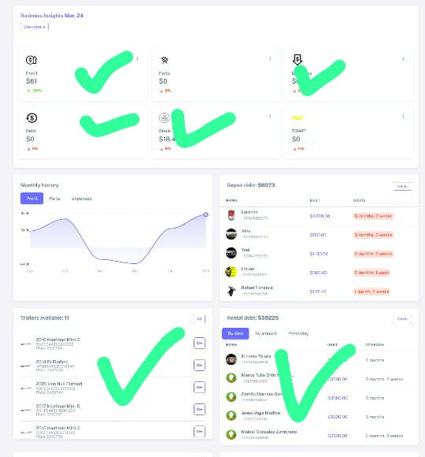
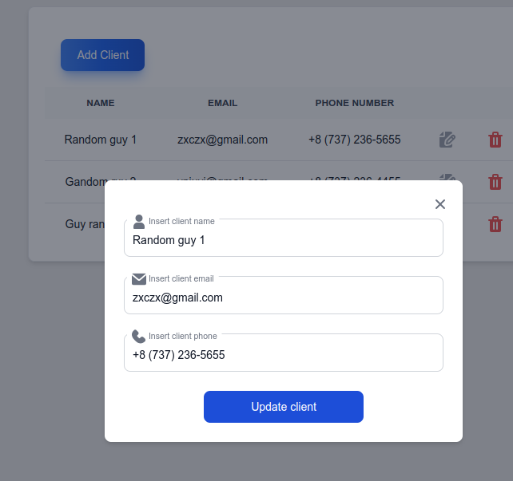
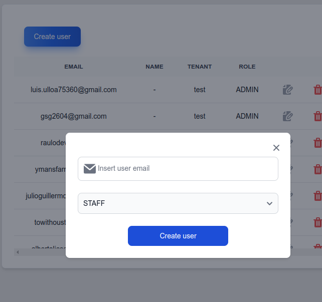
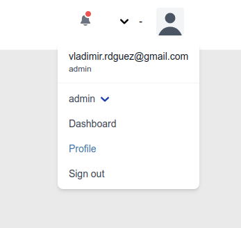
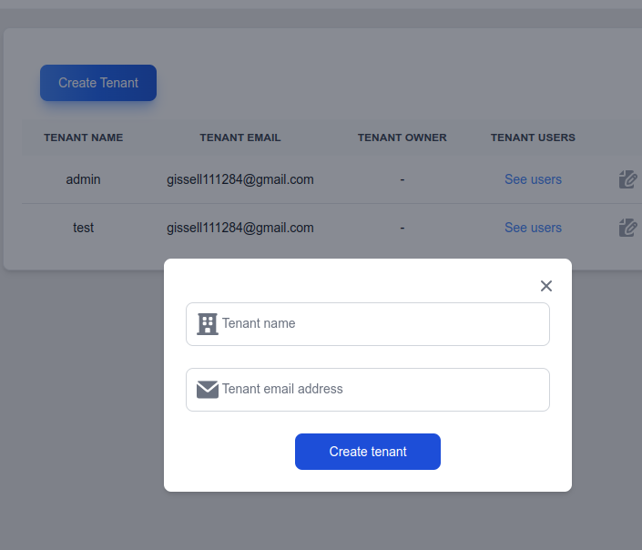
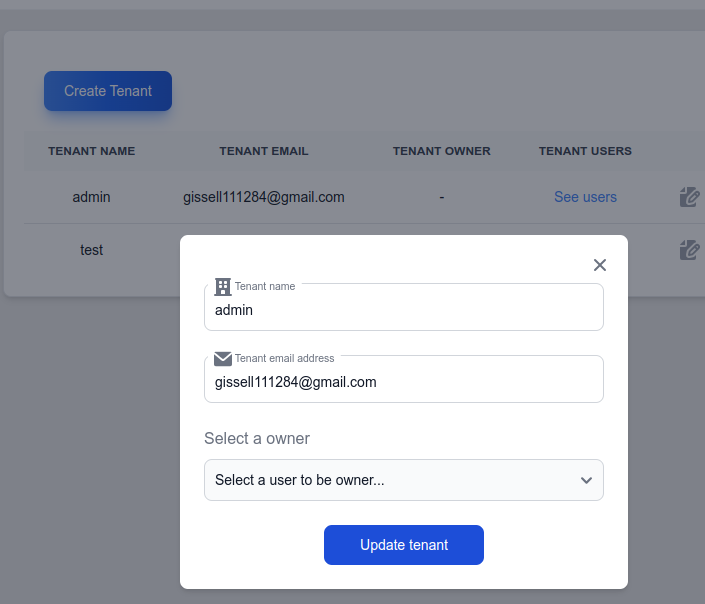

# Rutas y vistas de software de renta

En esta página hacemos un listado de las vistas de la aplicación. En el caso en el que ya está programado, incluimos un estado a la vista actual para que pueda ser modificada. En algunos casos se incluyen referencias de como debe quedar la vista, pero debe ser usada como un punto de partida. Es importante mantener la coherencia en el estilo de la aplicación a lo largo de todas las rutas y también entre la vista de celular y la vista de computadora. Otra recomendación es tratar de mantener el diseño cerca de lo que trae por defecto [Flowbite](https://flowbite-svelte.com/) siempre que sea posible.

## Control de acceso

### Login
El [estado actual](https://fleet.crabdance.com/signin) de esta vista.

Esta hay que arreglarla para que se vea bien y debe formar parte de la identidad. No podemos usar un referente para esto.

### Código enviado
El [estado actual](https://fleet.crabdance.com/verifyRequest) de esta vista. Esto carga cuando te autenticas con un enlace mágico que te es enviado al correo. Una vez enviado el código te redirecciona a esta vista.

## Dashboard

El [estado actual](https://fleet.crabdance.com/dashboard) de esta vista.
La información que debe mostrarse allí, al menos inicialmente es la [del gestor](https://playground.towithouston.com/erp/). 

Hay que considerar que de lo que se muestra actualmente en el gestor, solo las que se marcan en la siguiente figura importan.

## People
### Clients
Esta es la[ vista actual](http://fleet.crabdance.com/clients). 

Además se puede crear:

y editar:

### Users
Esta es la[ vista actual](http://fleet.crabdance.com/users) de los usuarios. Los usuarios son los que pueden ingresar a la plataforma con base a su correo. Por eso, ese es el único dato que se les pide.

Además se puede crear y editar desde un tenant normal:

o desde el tenant admin:

En este caso, además del correo y el rol, se necesita especificar el tenant. El tenant admin es para ser usado en la gestión del negocio, es el único que puede crear nuevos tenants y crear usuarios en los mismos.

### Profile
Esta es la[ vista actual](http://fleet.crabdance.com/profile). Los usuarios son responsables de administrar su perfil:

Modificar los datos:

## Tenants

Esta es la[ vista actual](http://fleet.crabdance.com/admin/tenants).  

Además se puede crear:

y editar:

En este se puede asignar un dueño al tenant. El dueño tiene privilegio para crear nuevos usuarios asignados a su tenant.

### Seleccionar tenant
Esto debería hacerse como en odoo:

