# Rutas y vistas de software de renta

En esta página hacemos un listado de las vistas de la aplicación. En el caso en el que ya está programado, incluimos un estado a la vista actual para que pueda ser modificada. En algunos casos se incluyen referencias de como debe quedar la vista, pero debe ser usada como un punto de partida. Es importante mantener la coherencia en el estilo de la aplicación a lo largo de todas las rutas y también entre la vista de celular y la vista de computadora. Otra recomendación es tratar de mantener el diseño cerca de lo que trae por defecto [Flowbite](https://flowbite-svelte.com/) siempre que sea posible.

## Control de acceso

### Login
El [estado actual](https://fleet.crabdance.com/signin) de esta vista.

Esta hay que arreglarla para que se vea bien y debe formar parte de la identidad. No podemos usar un referente para esto.

### Código enviado
El [estado actual](https://fleet.crabdance.com/verifyRequest) de esta vista. Esto carga cuando te autenticas con un enlace mágico que te es enviado al correo. Una vez enviado el código te redirecciona a esta vista.

## Dashboard

El [estado actual](https://fleet.crabdance.com/dashboard) de esta vista.
La información que debe mostrarse allí, al menos inicialmente es la [del gestor](https://playground.towithouston.com/erp/). 

Hay que considerar que de lo que se muestra actualmente en el gestor, solo las que se marcan en la siguiente figura importan.

### Admin dashboard

Desde el punto de vista del tenant admin, esta vista debe mostrar información relativa a los tenants como:

- Listados de tenants activos
- Pagos pendientes por parte de los tenants a la plataforma
- Datos del estado de los servidores:
  - Espacio en disco
  - Base de datos
  - RAM y CPU
- Consumo de recurso por tenants

## People
### Clients
Esta es la[ vista actual](http://fleet.crabdance.com/clients). 

Además se puede crear:

y editar:

### Users
Esta es la[ vista actual](http://fleet.crabdance.com/users) de los usuarios. Los usuarios son los que pueden ingresar a la plataforma con base a su correo. Por eso, ese es el único dato que se les pide.

Además se puede crear y editar desde un tenant normal:

o desde el tenant admin:

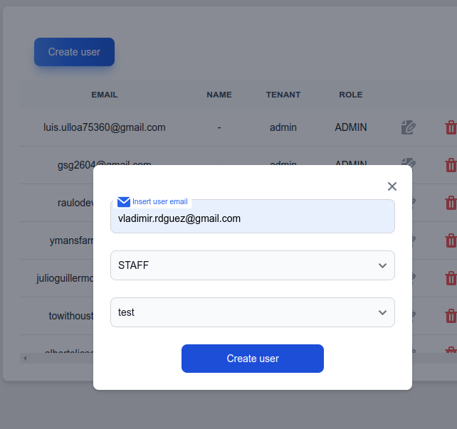

En este caso, además del correo y el rol, se necesita especificar el tenant. El tenant admin es para ser usado en la gestión del negocio, es el único que puede crear nuevos tenants y crear usuarios en los mismos.

### Profile
Esta es la[ vista actual](http://fleet.crabdance.com/profile). Los usuarios son responsables de administrar su perfil:

Modificar los datos:

## Tenants

Esta es la[ vista actual](http://fleet.crabdance.com/admin/tenants).  

Además se puede crear:

editar:

y puede listarse a los usuarios de cual quier  tenant:

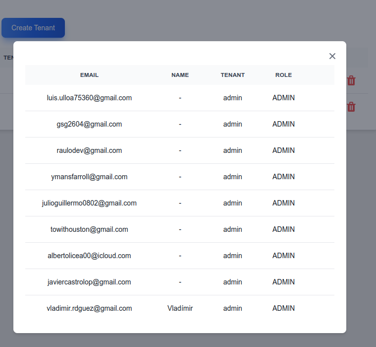

En este se puede asignar un dueño al tenant. El dueño tiene privilegio para crear nuevos usuarios asignados a su tenant.

### Seleccionar tenant
Esto debería hacerse como en odoo:

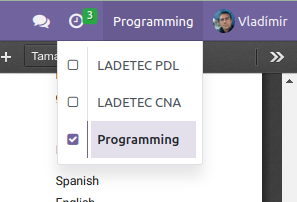

## Vehículos
Acá mostramos las vistas de whiparound que son las que más se parecen a lo que queremos lograr.

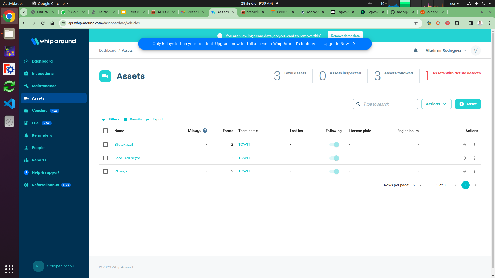

Para crear un vehículos vamos a tratar de conseguir primero el VIN pues de allí pueden extraerse muchos datos para el formulario:

 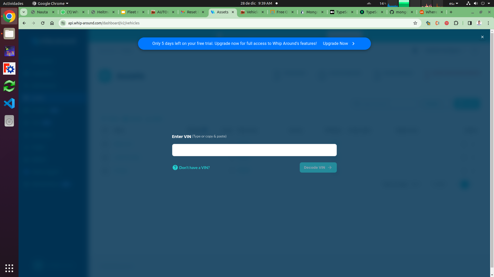

 Al final, ya sea que se capturen datos a partir del VIN o no, pasamos al formulario:

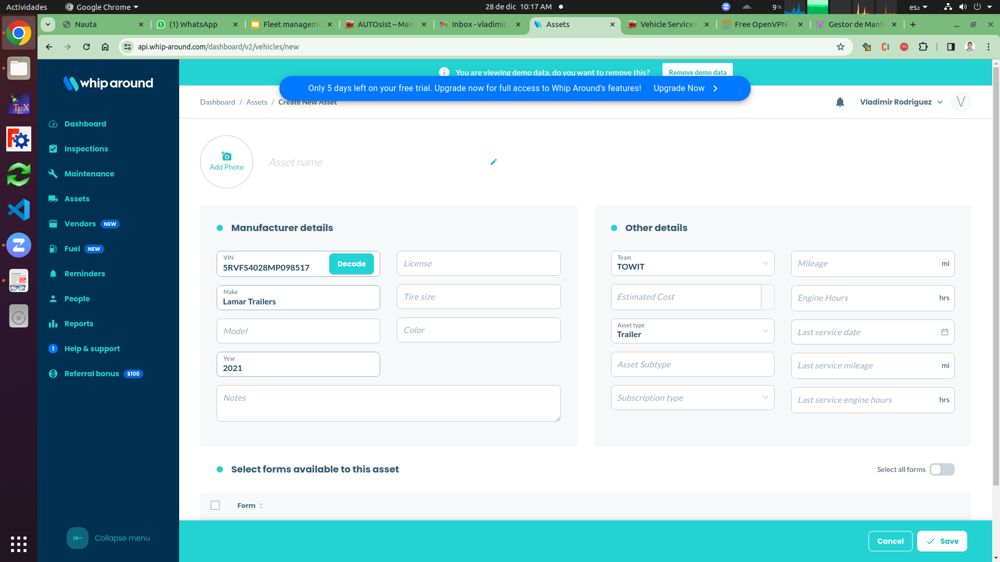 

Los detalles del vehículo se muestran así:

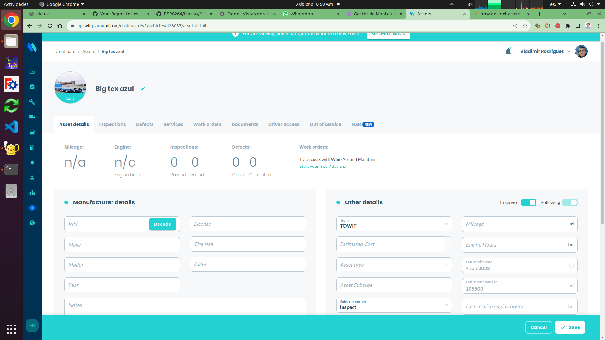

Acá conviene también incorporar una galería de imágenes como en un producto de una tienda. Como estos artículos se rentan, es importante contar con varias imágenes y poderlas compartir. 

En el [gestor](https://playground.towithouston.com/erp/rent/detail-trailer/1) hacemos este trabajo con las imágenes. 

A diferencia de lo que se muestra en esta vista, no vamos a dar la opción de editar los datos del vehículo en esta  vista. 

Desde la vista de detalles del vehículo también debemos tener acceso a:

- Ver detalles del contrato activo
- Crear un contrato de renta si está disponible
- Dar seguimiento a partir de un [rastreador](#rastreadores) GPS
- Ver los documentos del vehículo
- Seleccionar los [formularios de inspección](#formularios) que aplican al vehículo:
 

### Rastreadores

Esta es la[ vista actual](http://fleet.crabdance.com/trackers).  

Además se puede crear:

editar:

## Inspecciones

Este módulos está inspirado en el módulo de inspecciones de whiparound. Allí al parecer se llenan solo en la vista de celular las inspecciones. Acá por el contrario se pueden llenar en la vista de PC también.

### Formularios

Los formularios de inspección están basados en tarjetas, dentro de las cuales se agregan los campos. Esta es la[ vista actual](http://fleet.crabdance.com/inspections/forms).  

Además se puede crear:

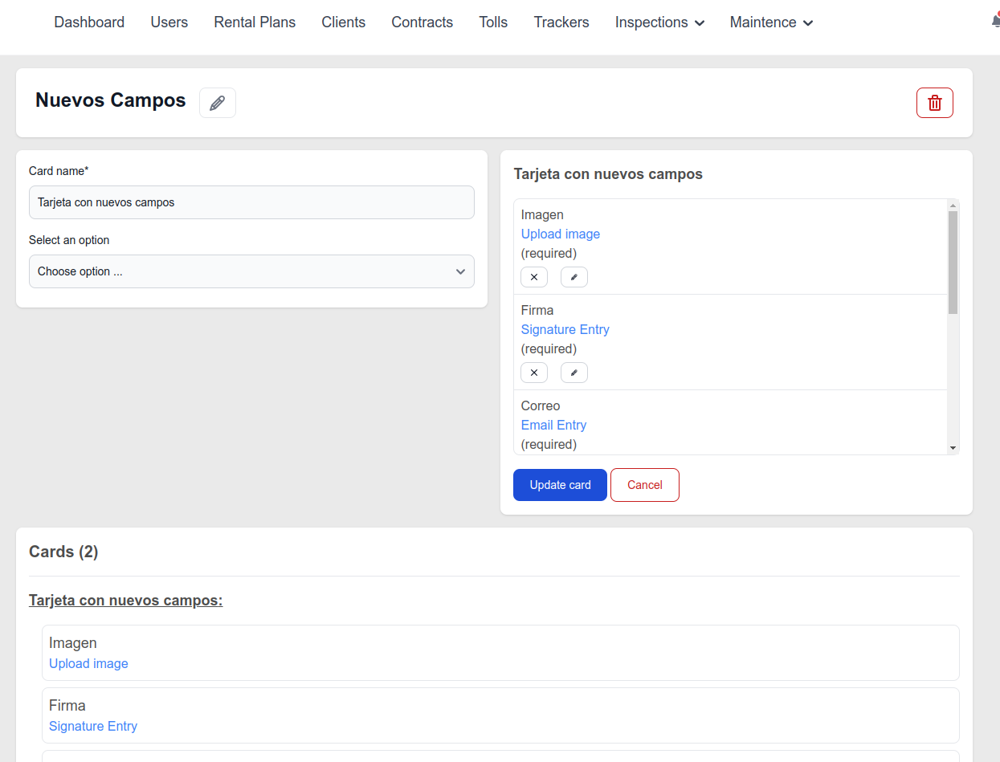

editar:

Los campos también son editable:

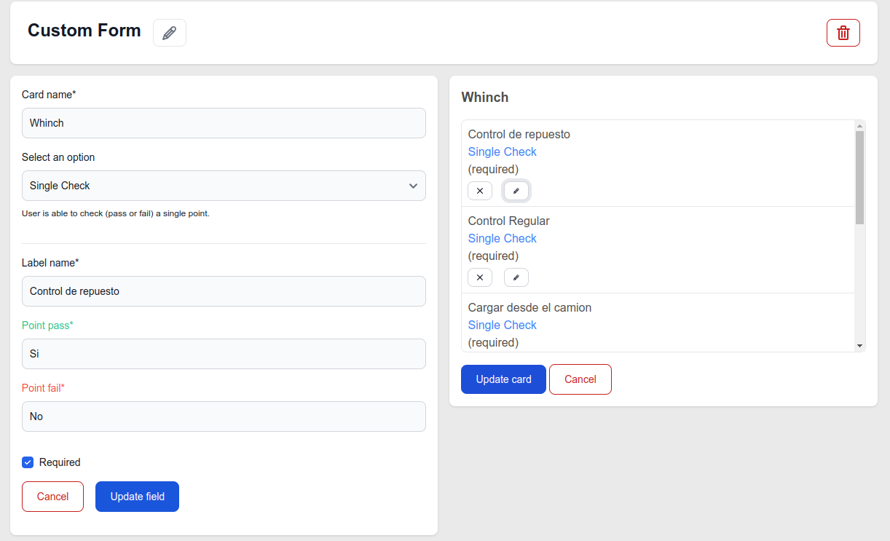

### Inspecciones realizadas

Esta es la[ vista actual](http://fleet.crabdance.com/inspections).  

Además se puede crear:

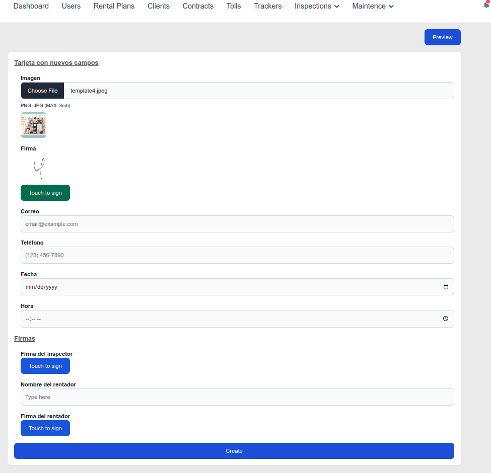

previsualizar:

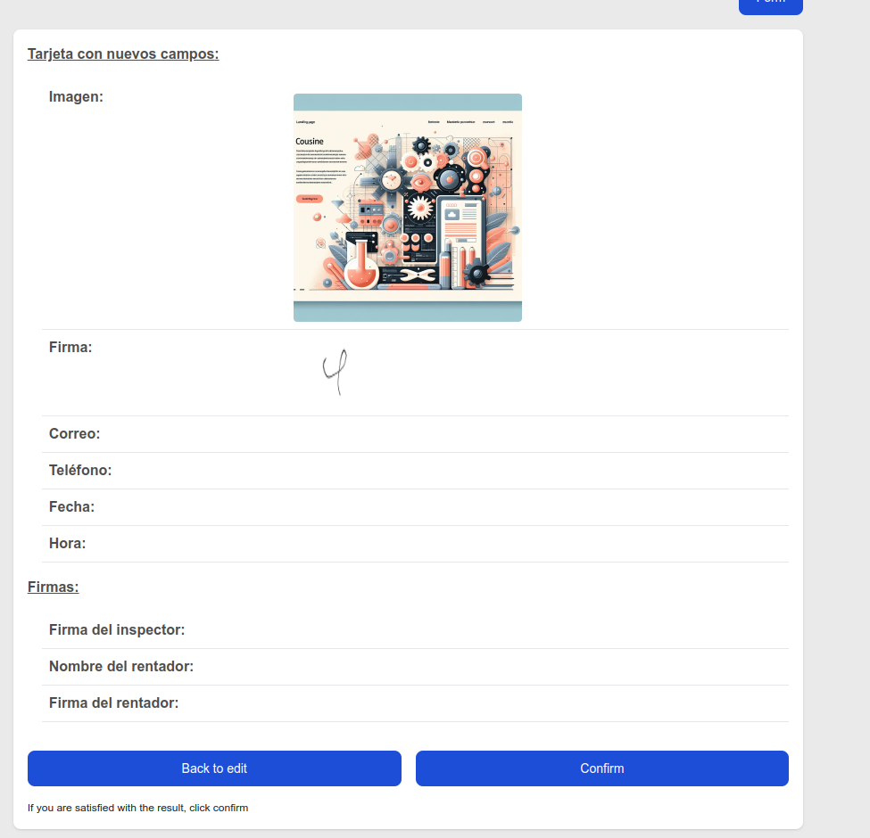

## Contratos

### Planes de renta

### Lista de contratos

### Notas

### Facturas

### Pagos

### Tolls

Los tolls hacen referencia a los pagos de peaje que se cargan al duelo del vehículo pero que deben ser pagados por el cliente que lo tiene rentado. Por eso, una vez que llega una notificación de este tipo de cargos, se registra manualmente en la plataforma para ser cobrado al cliente. Esta es la[ vista actual](http://fleet.crabdance.com/tolls).  

Además se puede crear:

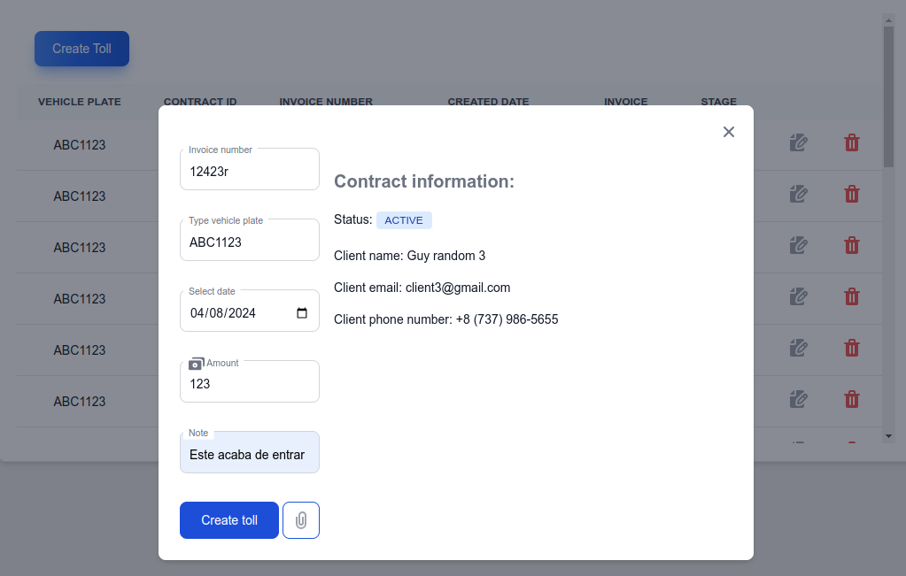

editar:

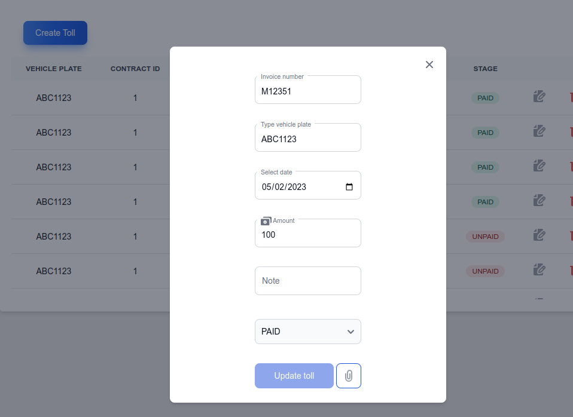

Los tolls deben poder verse en la vista de contrato.

### Línea de tiempo

La línea de tiempo debe mostrar el histórico de lo que ocurre en elemento actual. En los contratos se trata de:

- Estado del contrato
- [Facturas](#facturas)
- [Pagos](#pagos)
- [Notas](#notas)
- [Tolls](#tolls)

Esta información aparece en orden cronológico inverso. En cada una debemos mostrar el usuario responsable de la acción si lo hubiere (como en odoo):

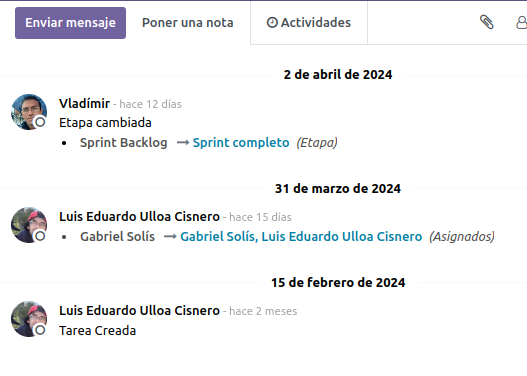

Cada tipo de elemento va en un color y/o con un ícono diferente. El usuario tiene arriba un filtro para quedarse con un solo tipo de elemento (por ejemplo, si quisiera ver solamente los pagos).

## Gastos

## Recordatorios